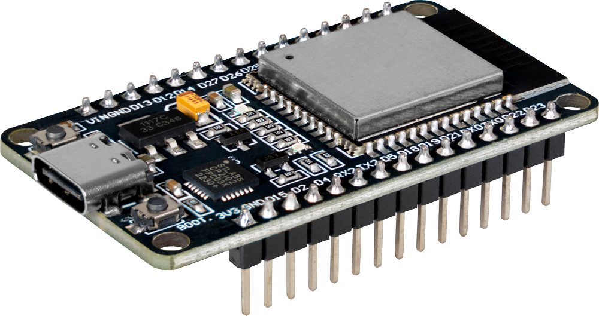

*This article is generated using Gemini 3.1 Pro and edited by SESS.*

If you’re an engineering or computer science student working with IoT devices on campus, you’ve probably hit this exact wall: you bring your ESP32 to Seneca Polytechnic, fire up your standard WiFi connection code, and... nothing. It refuses to connect to SenecaNET.

It's a frustrating roadblock, but it's not a bug in your code. It all comes down to how institutional networks authenticate devices.

In this tutorial, we'll explain why your ESP32 hates SenecaNET, why **eduroam** is your saving grace, and how to write the code to get your microcontroller online securely.



## The Problem: Why SenecaNET Blocks Your ESP32

SenecaNET (like many primary campus or guest networks) typically relies on a **Captive Portal**.

When you connect to SenecaNET on your phone or laptop, the network intercepts your first web request and redirects you to a login page. You type in your student credentials, click "Accept Terms," and then you get internet access.

The ESP32 is a "headless" device. It doesn't have a built-in web browser or a human to click "I Accept." While it is technically possible to write complex code to scrape and bypass a captive portal, it is highly unreliable because IT departments frequently update these login pages. When the page changes, your code breaks.

## The Solution: 802.1X Authentication and eduroam

Instead of fighting the captive portal, we can use **eduroam**.

Eduroam is the secure, worldwide roaming access service developed for the international research and education community. Instead of using a captive portal, eduroam uses **WPA2-Enterprise** (specifically the 802.1X standard).

WPA2-Enterprise allows a device to pass its username and password directly to the network router behind the scenes during the initial connection handshake. Fortunately, the ESP32’s WiFi chip has native, under-the-hood support for WPA2-Enterprise authentication.

By feeding our student email and password directly to the ESP32's underlying WiFi driver, we can authenticate immediately and get straight to the internet.


## The Code: Connecting ESP32 to eduroam

Here is the complete Arduino sketch to get your ESP32 connected to eduroam.

> 🚨 **CRITICAL SECURITY WARNING:** You will be putting your actual Seneca student email and password into this code. **DO NOT** commit or upload this file to a public GitHub repository. Always add your credentials file to your .gitignore or strip them out before sharing your code!

``` c
#include <WiFi.h>
#include <HTTPClient.h>
#include "esp_wifi.h"
#include "esp_wpa2.h"

#define SSID "eduroam"

#define EAP_IDENTITY ""  // Not required to connect eduroam as a Seneca user
#define EAP_USERNAME "your_email@myseneca.ca"  // DO NOT SAVE this into an online Repo
#define EAP_PASSWORD "your_password"           // DO NOT SAVE this into an online Repo !!!!!!!!!!!
#define EAP_ANON_ID  ""  // Not required to connect eduroam as a Seneca user

void setup() {

  Serial.begin(115200);
  delay(2000);

  // 1. Reset WiFi and set to Station mode (client)
  WiFi.disconnect(true);
  WiFi.mode(WIFI_STA);

  Serial.println("Connecting...");

  // 2. Configure WPA2-Enterprise Authentication
  esp_wifi_sta_wpa2_ent_set_identity(
    (uint8_t*)EAP_ANON_ID,
    strlen(EAP_ANON_ID));

  esp_wifi_sta_wpa2_ent_set_username(
    (uint8_t*)EAP_USERNAME,
    strlen(EAP_USERNAME));

  esp_wifi_sta_wpa2_ent_set_password(
    (uint8_t*)EAP_PASSWORD,
    strlen(EAP_PASSWORD));

  // 3. Enable WPA2-Enterprise and connect
  esp_wifi_sta_wpa2_ent_enable();
  WiFi.begin(SSID);

  // Wait for connection
  while (WiFi.status() != WL_CONNECTED) {
    delay(500);
    Serial.print(".");
  }

  Serial.println("\nWiFi Connected!");

  // 4. Test the Internet Connection
  HTTPClient http;
  Serial.println("Requesting example.com ...");
  http.begin("http://example.com");
  
  int httpCode = http.GET();
  Serial.print("HTTP Response Code = ");
  Serial.println(httpCode);

  if (httpCode > 0) {
    String payload = http.getString();
    Serial.println("SUCCESS — Internet works!");
    Serial.println(payload.substring(0,200)); // prints part of the webpage
  } else {
    Serial.println("FAILED — No internet access.");
  }

  http.end();
}

void loop() {
  // Your IoT application logic goes here!
}
```

## How It Works

1. **Headers:** We include `esp_wifi.h` and `esp_wpa2.h`. These give us access to the low-level Espressif framework functions needed for Enterprise networking, bypassing the standard simple `WiFi.begin(ssid, password)` function.

2. **Configuration:** We use the `esp_wifi_sta_wpa2_ent_set_*` functions to load our Seneca credentials directly into the ESP32's WiFi stack.

3. **Connection:** `esp_wifi_sta_wpa2_ent_enable()` turns on Enterprise mode. When we call `WiFi.begin(SSID)`, the ESP32 knows to negotiate using the credentials we just provided.

4. **Verification:** Finally, we use `HTTPClient` to ping `example.com`. If we get an HTTP 200 response code and a snippet of HTML back, we know we've successfully bypassed the restrictions and are live on the web!

## Next Steps

Now that your ESP32 is online at Seneca, you can start sending sensor data to the cloud, fetching API data, or communicating with an MQTT broker. Happy building!